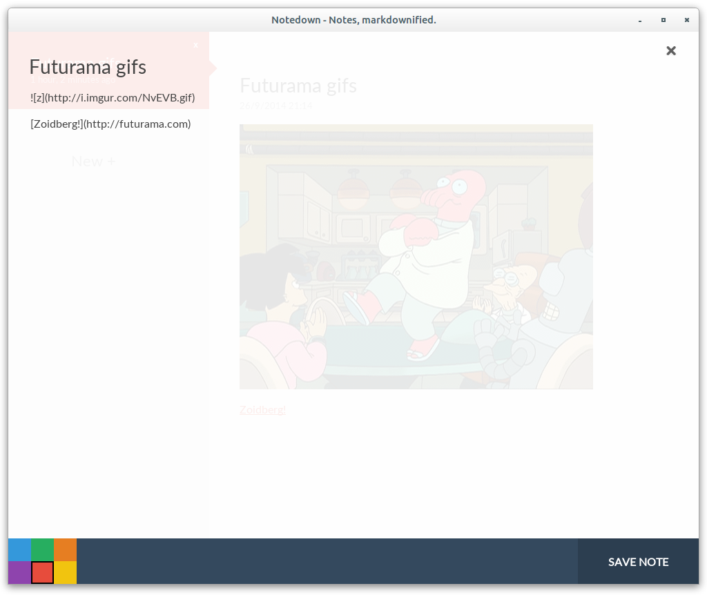
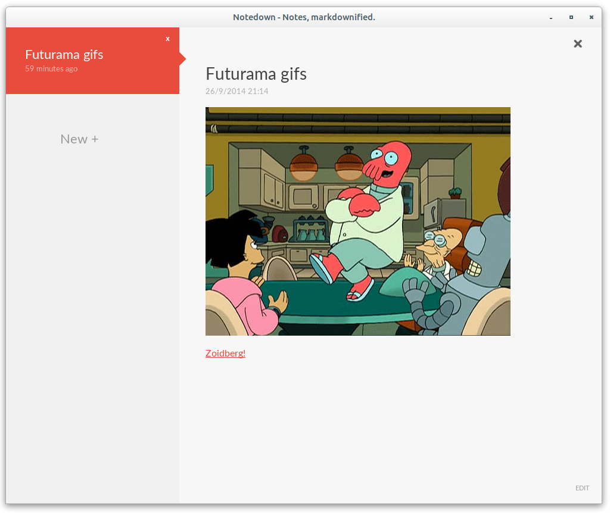

Notedown - Yup, notes with markdown.
-------------------------------------

Notedown is a node-webkit based NodeJS app for storing
your notes in markdown.

It does exactly as you would expect - provides a simple
interface for composing and viewing markdown based notes.

Download pre-built binaries, including node-webkit.
==========================================

Windows: [32bit]  
Linux: [32bit] / [64bit]  
Mac: [32bit] / [64bit]

How to compile.
===============

First, clone this repository.

	git clone https://github.com/isdampe/Notedown.git

Next, go download a suitable version of [node-webkit].

[node-webkit]: https://github.com/rogerwang/node-webkit

Copy node-webkit into the node-webkit/ folder

	cp ~/Downloads/node-webkit/* ~/git/notedown/node-webkit/

Install the Node dependencies

	cd ~/git/notedown/node-webkit
	npm install

Launch the app

	./nw

Contributing.
=============

Send pull-requests at will.